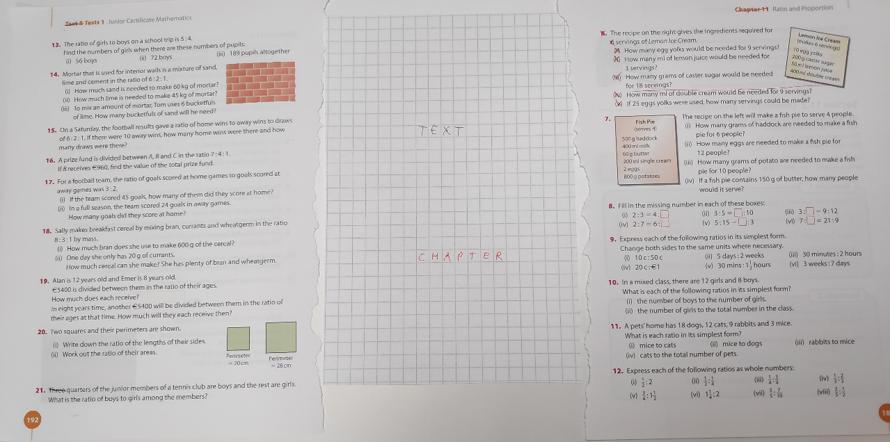
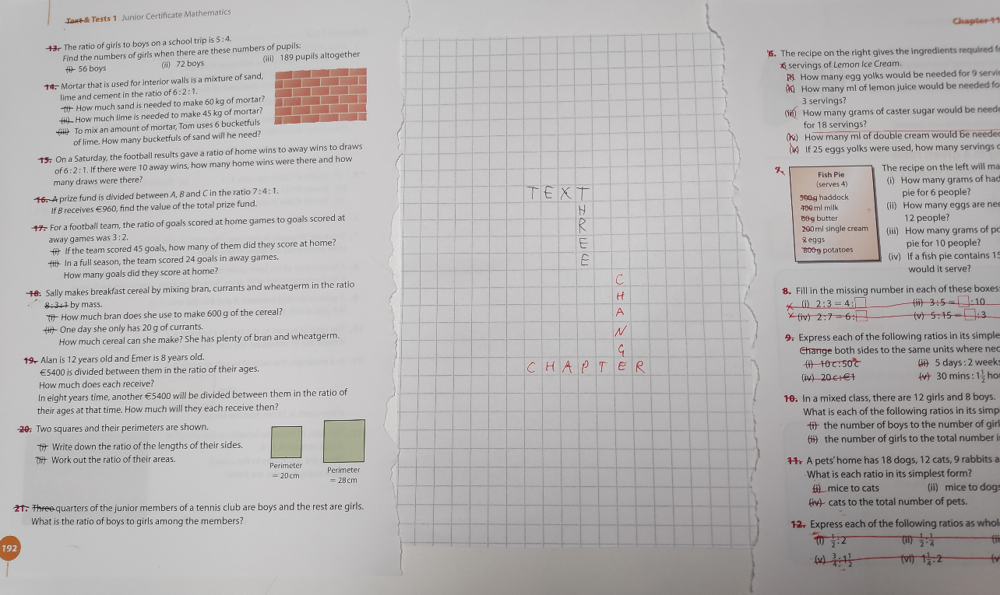
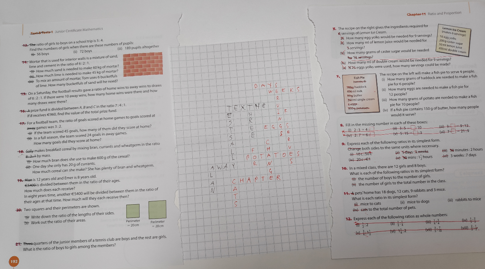
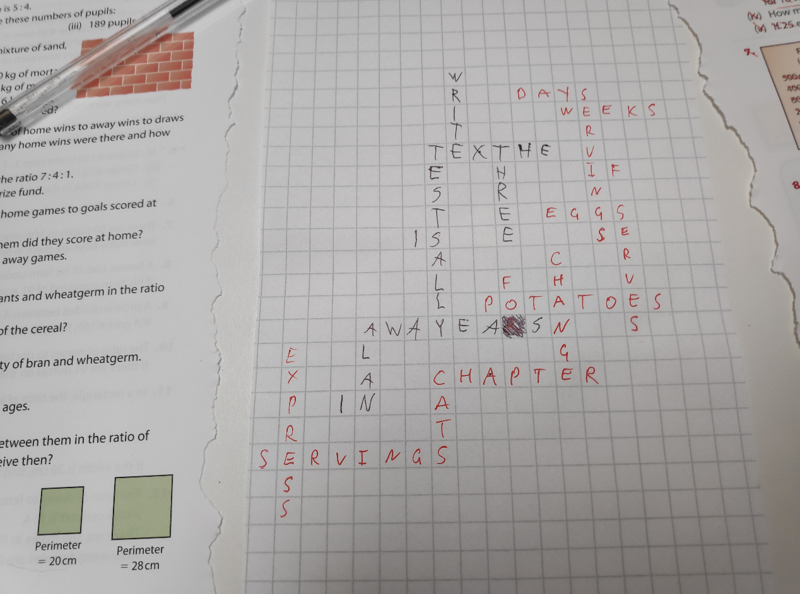
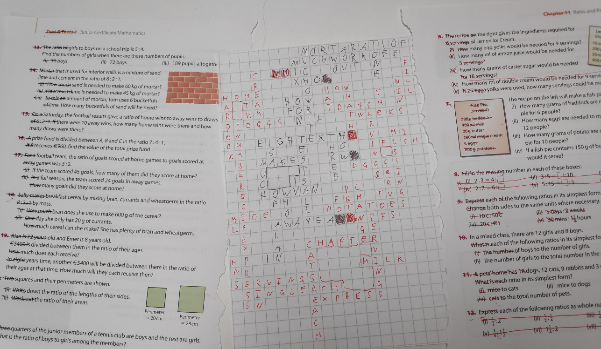

# Example of the played game explained.

Initial game setup. The Black player sheet is on the left, and The Red player sheet is on the right. 

After playing the first round. Black used word from one of the last rows. Red used word from the row in the center. You could see some things are struck out explicitly, so it is easier to track words.

After multiple rounds. Players are trying to block each other from capturing more territory.

Black player captures the first cell by using the word "years". Captured cell can't be used anymore.

End of the game. Black run out of time. Red one had an extra 30 seconds, and he added 3 words. In the top left, there are two red cells that we black mistakes. 

