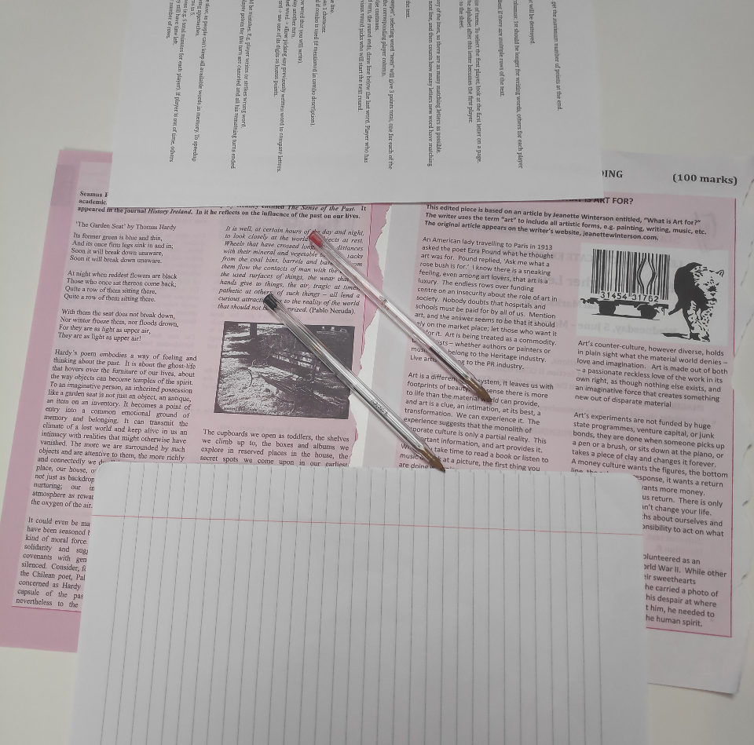
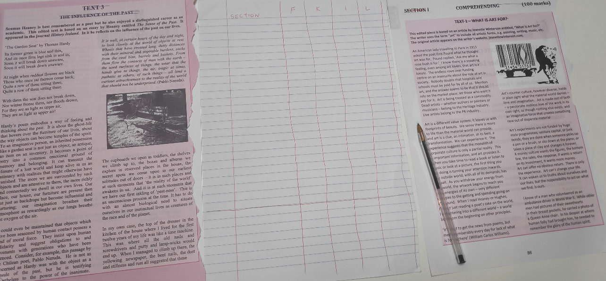
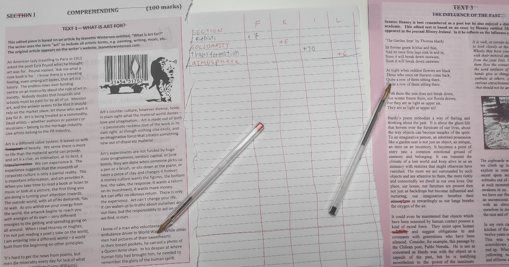
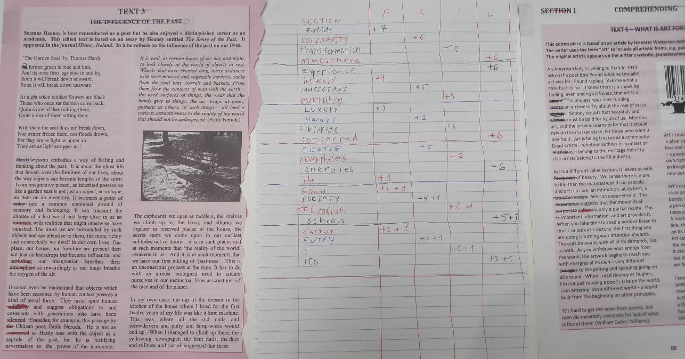
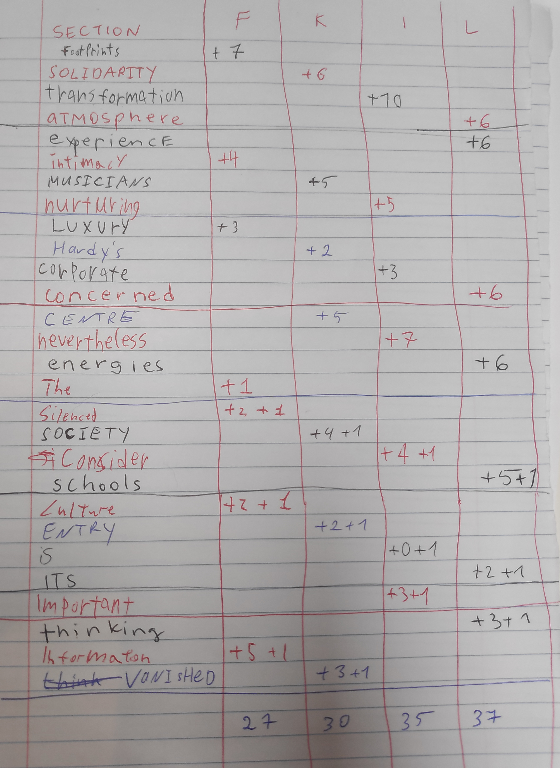

# Example of the played game explained.

Initial game setup. 2nd page is given to the next player, to speed up the game.

Writing first word and eliminating short lines. The game is ready to be played.

After playing the first round.

After multiple rounds. After round 4, we added additional rule:
+1 point if player managed to announce word within 30 seconds, or write the first word of the page, if time expired.
Each score marked with +1, indicating that word was chosen within 30 seconds after starting the turn.

End of the game.  L player won.

